# Ex.No.1---Data-Preprocessing
## AIM:

### To perform Data preprocessing in a data set downloaded from Kaggle

## REQUIPMENTS REQUIRED:
### Hardware – PCs
### Anaconda – Python 3.7 Installation / Google Colab /Jupiter Notebook

## RELATED THEORETICAL CONCEPT:

### Kaggle :
#### Kaggle, a subsidiary of Google LLC, is an online community of data scientists and machine learning practitioners. Kaggle allows users to find and publish data sets, explore and build models in a web-based data-science environment, work with other data scientists and machine learning engineers, and enter competitions to solve data science challenges.

### Data Preprocessing:

#### Pre-processing refers to the transformations applied to our data before feeding it to the algorithm. Data Preprocessing is a technique that is used to convert the raw data into a clean data set. In other words, whenever the data is gathered from different sources it is collected in raw format which is not feasible for the analysis.
#### Data Preprocessing is the process of making data suitable for use while training a machine learning model. The dataset initially provided for training might not be in a ready-to-use state, for e.g. it might not be formatted properly, or may contain missing or null values.Solving all these problems using various methods is called Data Preprocessing, using a properly processed dataset while training will not only make life easier for you but also increase the efficiency and accuracy of your model.

### Need of Data Preprocessing :

#### For achieving better results from the applied model in Machine Learning projects the format of the data has to be in a proper manner. Some specified Machine Learning model needs information in a specified format, for example, Random Forest algorithm does not support null values, therefore to execute random forest algorithm null values have to be managed from the original raw data set.
#### Another aspect is that the data set should be formatted in such a way that more than one Machine Learning and Deep Learning algorithm are executed in one data set, and best out of them is chosen.


## ALGORITHM:
### 1. Importing the libraries
### 2. Importing the dataset
### 3. Taking care of missing data
### 4. Encoding categorical data
### 5. Normalizing the data
### 6. Splitting the data into test and train

## PROGRAM:
```
Done by:M.Suwetha
Reg no : 212221230112
import pandas as pd
import numpy as np

df = pd.read_csv("Churn_Modelling.csv")
df

df.isnull().sum()

#Check for Duplicate Values
df.duplicated()

df.describe()

#Detect the Outliers
# Outliers are any abnormal values going beyond
df['Exited'].describe()

""" Normalize the data - There are range of values in different columns of x are different. 

To get a correct ne plot the data of x between 0 and 1 

LabelEncoder can be used to normalize labels.
It can also be used to transform non-numerical labels to numerical labels.
"""
from sklearn.preprocessing import LabelEncoder
le = LabelEncoder()

df1 = df.copy()

df1["Geography"] = le.fit_transform(df1["Geography"])
df1["Gender"] = le.fit_transform(df1["Gender"])

'''
MinMaxScaler - Transform features by scaling each feature to a given range. 
When we normalize the dataset it brings the value of all the features between 0 and 1 so that all the columns are in the same range, and thus there is no dominant feature.'''

from sklearn.preprocessing import StandardScaler
from sklearn.preprocessing import MinMaxScaler

scaler = MinMaxScaler()

df1[["CreditScore","Geography","Age","Tenure","Balance","NumOfProducts","EstimatedSalary"]] = pd.DataFrame(scaler.fit_transform(df1[["CreditScore","Geography","Age","Tenure","Balance","NumOfProducts","EstimatedSalary"]]))

df1

df1.describe()

# Since values like Row Number, Customer Id and surname  doesn't affect the output y(Exited).
#So those are not considered in the x values
X = df1[["CreditScore","Geography","Gender","Age","Tenure","Balance","NumOfProducts","HasCrCard","IsActiveMember","EstimatedSalary"]].values
print(X)

y = df1.iloc[:,-1].values
print(y)

from sklearn.model_selection import train_test_split
X_train, X_test, y_train, y_test = train_test_split(X, y, test_size=0.2)

print(X_train)
print("Size of X_train: ",len(X_train))

print(X_test)
print("Size of X_test: ",len(X_test))

X_train.shape
```

## OUTPUT:
### Dataset
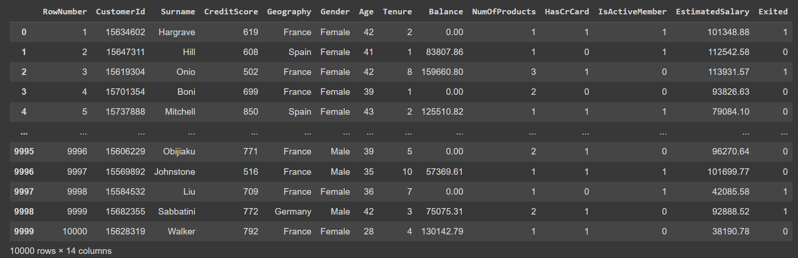
### Checking for Null Values
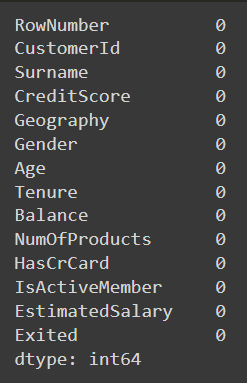
### Checking for duplicate values
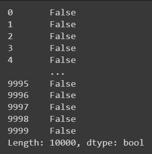
### Describing Data
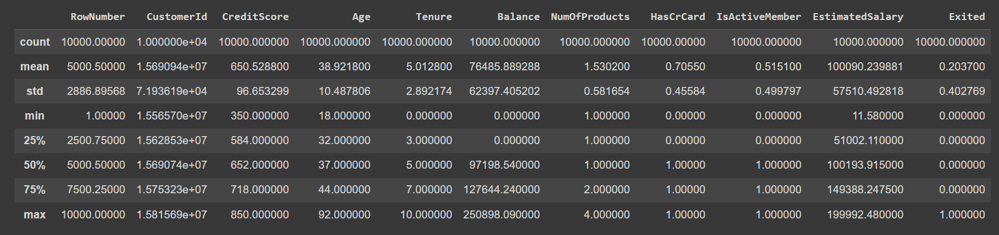
### Checking for outliers in Exited Column
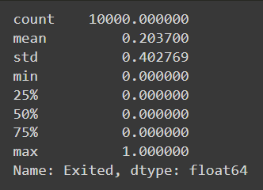
### Normalized Dataset
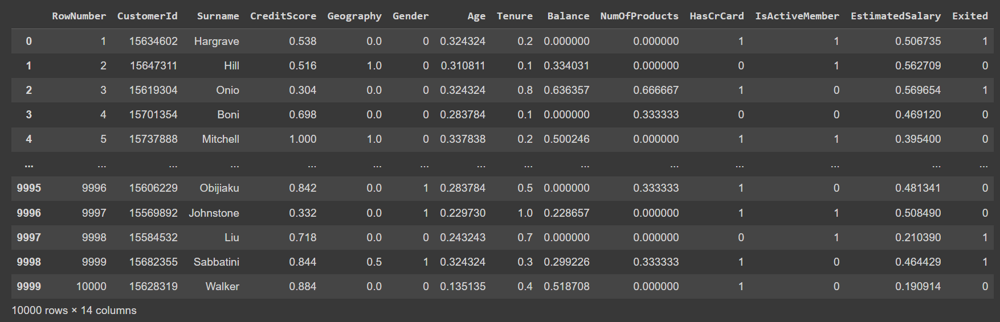
### Describing Normalized Data
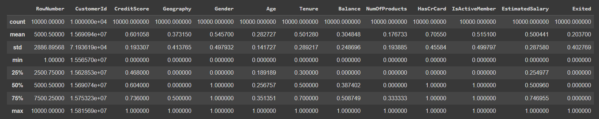
### X - Values
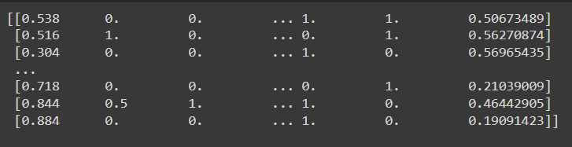
### Y - Value
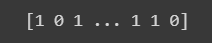
### X_train values 
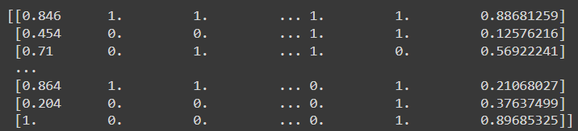
### X_train Size
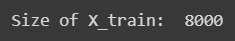
### X_test values 
![x_test(x_test.png)
### X_test Size
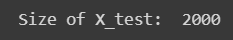
### X_train shape
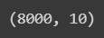

## RESULT
### Data preprocessing is performed in a data set downloaded from Kaggle
